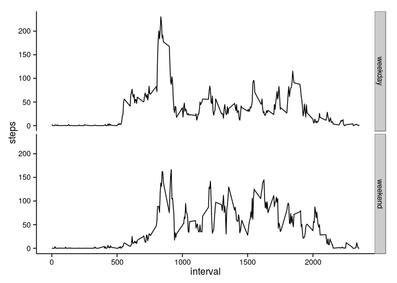

# Reproducible Research: Peer Assessment 1
Activity Monitoring is on the rise through the use of various activity monitoring devices as part of the Quantified Self movement. Below we try to analyse the monitoring data of an anonymous individual over a period of two months. 

## Loading and preprocessing the data

The data are contained in a csv file with the headings *steps*, *date* and *interval*. These are read into the data frame *df*. The data in the date column are explicitly converted to Date format.


```r
df <- read.csv("activity.csv")
df$date <- as.Date(df$date)
str(df)
```

```
## 'data.frame':	17568 obs. of  3 variables:
##  $ steps   : int  NA NA NA NA NA NA NA NA NA NA ...
##  $ date    : Date, format: "2012-10-01" "2012-10-01" ...
##  $ interval: int  0 5 10 15 20 25 30 35 40 45 ...
```


## What is mean total number of steps taken per day?

The steps taken each day are calculated using *tapply* on the *sum* function using the *date* field as the index. The distribution of steps taken each day is shown in the following histogram. We see that most frequently steps per day were in the region 10000 - 15000.


```r
stepspd <- with(df,tapply(steps,date,sum,na.rm=TRUE))
hist(stepspd,xlab="Steps per day",main="")
```

 

We then take the mean and median of the number of steps for each day


```r
mean(stepspd,na.rm=TRUE)
```

```
## [1] 9354.23
```

```r
median(stepspd,na.rm=TRUE)
```

```
## [1] 10395
```

The mean number of steps per day is approximately 9354 and the median is 10395.

## What is the average daily activity pattern?

The average daily pattern is obtained by averaging across the days for each interval.


```r
stepspi <- with(df,tapply(steps,interval,mean,na.rm=TRUE))
ints <- unique(df$interval)
dap <- data.frame(ints=ints,stepspi=stepspi)
plot(dap,type="l",xlab="interval",ylab="steps")
```

 

The maximum number of steps in any interval is


```r
maxSteps <- max(dap$stepspi,na.rm=T)
maxSteps
```

```
## [1] 206.1698
```

and occurs at the interval


```r
dap[dap$stepspi == maxSteps,"ints"]
```

```
## [1] 835
```

## Imputing missing values

The number of missing values in the data frame can be calculated as


```r
sum(is.na(df$steps))
```

```
## [1] 2304
```

We can replace the *NA* values with the means previously calculated for the respective intervals. The method is based on the solution found [here](http://stackoverflow.com/questions/9322773/how-to-replace-na-with-mean-by-subset-in-r-impute-with-plyr)


```r
library(plyr)

# function to replace NA with the mean
impute.mean <- function(x) replace(x, is.na(x), mean(x, na.rm = TRUE))

# perform replacement and store in new data frame
df2 <- ddply(df, ~ interval, transform, steps = impute.mean(steps),
     date = date)

# reorder data frame by date
df2 <- df2[order(df2$date),]
```

A new histogram can be plotted as before


```r
stepspd2 <- with(df2,tapply(steps,date,sum,na.rm=TRUE))
hist(stepspd2,xlab="Steps per day",main="")
```

 

As well as a new mean and median


```r
mean(stepspd2,na.rm=TRUE)
```

```
## [1] 10766.19
```

```r
median(stepspd2,na.rm=TRUE)
```

```
## [1] 10766.19
```

The mean and median calculated with the imputed values are now equal and slightly higher than before. As can be seen from the new histogram, many of the days with low step count due to missing data have been shifted to the middle of he distribution.

## Are there differences in activity patterns between weekdays and weekends?

Finally we look at the difference between the activity on weekdays and weekends. We start by setting a new column *wkdayend* as a factor of *weekday* or *weekend*


```r
df2$wkdayend <- ifelse(weekdays(df2$date) %in% c("Saturday","Sunday"),"weekend","weekday")
```

We now plot the daily activity plot, however this time with *ggplot* and conditioned on the *wkdayend* factor.


```r
library(ggplot2)
q <- qplot(interval,steps,data=df2,geom = "line", stat="summary", fun.y = "mean",facets = wkdayend ~ .)
q + theme_classic()
```

 

We see that the peak at interval 835 is even more pronounced on weekdays, with weekends seeing a far more even distribution.
